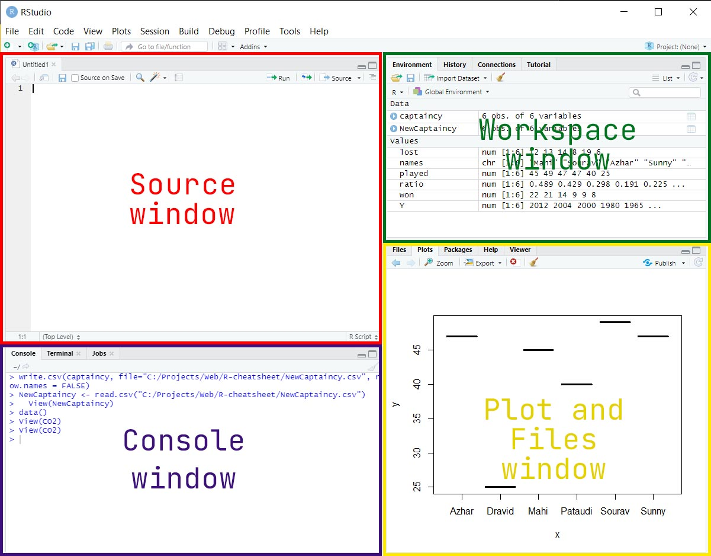

# R use case
### R is used for statistical modelling, Machine Learning and Data Science Applications
# Difference Between R and R studio
R|Rstudio
---|---
R is programming language|Rstudio is an IDE for R(just like vscode, sublime, etc)
# Installation
### [R for windows 4.0.4](https://cran.r-project.org/bin/windows/base/R-4.0.4-win.exe)
### [Rstudio for windows](https://download1.rstudio.org/desktop/windows/RStudio-1.4.1106.exe)
# Rstudio

# Multiply
### `2.1*5`
# Divide
### `2.1*5/3`
# Addition
### `2+5`
# Variables
### `a <- 2+3` or `a = 2+3`
>#### Note `<-` and `=` differ in subtle ways but both can be used as assignment operators in our case
# Subtract
### `a-0.16`
# Power
### `(a)^0.5`
# Square Root
### `sqrt(a)`
# Exponential (e)
### `exp(1)`
# Natural Log (Log to base e)
### `log(exp(1))`
# Log to Base 10
### `log10(10^5)`
# Log to Base n
```R
> n = 10
> log(10^5, n)
[1] 5
```
# Pi (pi)
```R
> pi
[1] 3.141593
```
# Comments
### `#` is comment.
### Use `Ctrl+Shift+c` to comment the whole line.
```
> # This is a comment
```
# Basic Data Types
| Data Type | Values |
|-----------|--------|
| Numeric | Set of all real numbers |
| Integer | Set of all  integers Z |
| Logical | TRUE and FALSE |
| Character | "a", "b", "c", …, "@", "#", "$", …., "1", "2", …etc |
## 1. Numeric Data Type
```R
> v=2.53
> print(class(v))
[1] "numeric"
```
## 2. Integer Data Type
```R
> print(class(v))
[1] "interger"
```
## 3. Logical Data Type
```R
> v = TRUE
> print(class(v))
[1] "logical"
```
## 4. Complex Data Type
```R
> m=4+10i
> print(class(m))
[1] "4+10i"
```
# R-objects
||R-objects|
|---|---|
|1|Vectors|
|2|Lists|
|3|Matrices|
|4|Arrays|
|5|Factors|
|6|Data Frames|
## 1.1. Vectors - Homogenous Data
### Like arrays in C
### Vector must be created using concatenation function: c(parameters)
```R
> s <- c(1,2,3)
> print(s)
[1] 1 2 3

> branch=c('IT','CMPN','MECH')
> print(branch)
[1] "IT" "CMPN" "MECH"
```
## 1.2 Vectors using Sequence (seq)
```R
> z = seq(-1, 2, 0.5)
> z
[1] -1.0 -0.5 0.0 0.5 1.0 1.5 2.0
```
### Length of vectors
```R
> length(z)
[1] 7
```
># Plotting Graph (plot)
### Plot single variable to itself (y=x graph)
```R
> test = c(1,2,3)
> plot(test)
```
### A random Plot
```R
> x = seq(-2, 2, 1)
> x
[1] -2 -1  0  1  2
> y = sin(x)
> plot(x, y, type="l")
```
### A Better Sine curve plot
```R
> x = seq(-2*pi, 2*pi, 1)
> x
 [1] -6.2831853 -5.2831853 -4.2831853 -3.2831853 -2.2831853 -1.2831853 -0.2831853  0.7168147  1.7168147
[10]  2.7168147  3.7168147  4.7168147  5.7168147
> y = sin(x)
> plot(x, y, type="l")
```
### Best Sine curve plot
```R
> x = seq(-2*pi, 2*pi, 0.01)
> y = sin(x)
> plot(x, y, type="l")
```
### Changing Color and Plot Type - plot(_x_, _y_, _type=_...)
### We can change the plot type with the argument type. It accepts the following strings and has the given effect.
```BASH
"p" - points
"l" - lines
"b" - both points and lines
"c" - empty points joined by lines
"o" - overplotted points and lines
"s" and "S" - stair steps
"h" - histogram-like vertical lines
"n" - does not produce any points or lines
```
## 2. List - heterogenous data
```R
> n<- list(TRUE,123L,2.54,"bac",'f')
> n
> list1 <- list(c(2,5,3),21.3,'Hello')
> list1
```
>### Difference Between Vectors and List
Vectors|List
---|---
A vector is a single dimensional, homogenous data structure in R| List is a multi dimensional, heterogenous data structure in R
vector is not recursive| Lists are recursive
vector is one-dimensional object| list is a multidimensional object

[More Operations on Lists](#more-operations-on-lists)
## 3. Arrays: array()
```R
> a <- array(data = 1:8, dim= c(2,2))
> a
     [,1] [,2]
[1,]    1    3
[2,]    2    4
```
## 4. Matrices: matrix()
```R
> b <- matrix(data = 1:6, nrow=2, ncol=3)
> b
```
## Factor: Encodes a vector of unique elements (levels) from the given data vector.
### To create a factor, first create a vector
```R
> m  <-  c("Male","Female","Male","Female","Male","Female","Male","Female")
```
[More Operations on Matrices](#more-operations-on-matrices)
### Then make a factor using factor()
```R
> f <- factor(m)
> f
> levels(f) 
> unclass(f)
```

## 6. Data Frames
### Making Dataframe from Multiple vectors
```R
> names <- c("Mahi","Sourav","Azhar", "Sunny","Pataudi","Dravid") 
> names
> played <- c(45, 49, 47, 47, 40, 25)
> won <- c(22, 21, 14, 9, 9, 8)
> lost <- c(12, 13, 14, 8, 19, 6)
> Y <- c(2012, 2004, 2000, 1980, 1965, 2008)
> captaincy <- data.frame(names,Y, played,won,lost)
```
### Selecting A column in dataframe
```R
> View(captaincy)
> captaincy$names
> captaincy$won
> captaincy$played
> ratio = captaincy$won / captaincy$played
> ratio
```
### Adding a column in DataFrame
```R
> captaincy$victory = ratio
```
### Mean, median, mode
```R
> mean(captaincy$played)
> median(captaincy$played)
> mode(captaincy$played)
```
## Indexing in DataFrames
### Extract a row
```R
> captaincy[3,]
```
### Extract a column
```R
> captaincy[,3]
```
### ERxtract columns using numeric indexing
```R
> captaincy[3]
```
### Extract columns using name indexing
```R
> captaincy["names"]
```
### Extract multiple columns using name indexing
```
> captaincy[c("names", "won")]
```
### Extract more than one rows
```R
> captaincy[c(2,3), ]
or
> captaincy[2:3,]
```
### Extract rows using logical indexing
```R
> captaincy[captaincy$played==25,]
```
### Extracting a single value in a column, row
```R
> captaincy[[4]][3]
```
### Creating a New DataFrame as a subset of actual dataframe
```R
> subdata <- subset(captaincy, victory>0.3, select = c("names", "played", "won"))
> subdata
   names played won
1   Mahi     45  22
2 Sourav     49  21
6 Dravid     25   8
> print(class(subdata))
[1] "data.frame"
```
>## Various Plots on above DF
### Simple Plot on Captaincy year vs Ratio
```R
> plot(captaincy$Y, ratio)
```
### Plot with Characters on X axis and Numeric Data on Y axis
```R
> plot(captaincy$names, captaincy$played)
```
### The above plot will give error when the vector has character.
### To workaround that you should convert the vector to a factor.
```R
> plot(factor(captaincy$names), captaincy$played)
```
## Write DataFrame to a file
```R
Syntax - 
    write.csv(dataframe, file=output_file_path)

> write.csv(captaincy, file="NewCaptaincy.csv")
```
### Write w/o row numbers
```R
> write.csv(captaincy, file="NewCaptaincy.csv", row.names = FALSE)
```
# More operations on Matrices
## Create Matrices using some values from dataFrame - as.matrix()
```R
> subdata = captaincy[1:3, c("played", "won", "lost")]
> subdata
  played won lost
1     45  22   12
2     49  21   13
3     47  14   14
> matrixA <- as.matrix(subdata)
> matrixA
  played won lost
1     45  22   12
2     49  21   13
3     47  14   14
```
## Create Matrices using Vectors
```R
> values <- c(1,0,0,0,1,0,0,0,1)
> matrixB <- matrix(values, nrow=3, ncol=3, byrow = TRUE)
> matrixB
     [,1] [,2] [,3]
[1,]    1    0    0
[2,]    0    1    0
[3,]    0    0    1
```
## Basic Operations on Matrices
### Addition
```R
> matrixA + matrixB
  played won lost
1     46  22   12
2     49  22   13
3     47  14   15
```
### Subtraction
```R
> matrixA - matrixB
  played won lost
1     44  22   12
2     49  20   13
3     47  14   13
```
### Division
```R
> matrixA / matrixB
  played won lost
1     45 Inf  Inf
2    Inf  21  Inf
3    Inf Inf   14
```
### Element-wise multiplication
```R
> matrixA * matrixB
  played won lost
1     45   0    0
2      0  21    0
3      0   0   14
```
### Matrix Multiplication
```R
> matrixA %*% matrixB
  [,1] [,2] [,3]
1   45   22   12
2   49   21   13
3   47   14   14
```
### Transpose
```R
> t(matrixA)
```
### Determinant
```R
> det(matrixA)
```
### Inverse
```R
> solve(matrixA)
```
### Sum of a Matrix
*Run as Rscript*
```R
startTime <- Sys.time()
totalSum <- 0
for(i in 1:3){
    for(j in 1:3){
        totalSum <- totalSum + matrixA[i,j]
    }
}
print(totalSum)
endTime <- Sys.time()
print(endTime - startTime)
```
## Show list of Available DataFrames
```R
> data()
```
# Packages
## Checking for installed packages
```R
> library()
```
## Installing Packages
```R
> install.packages("MASS")
> install.packages("ggplot2")
```
## Using installed packages
```R
> library(MASS)
> fractions(3/4)
[1] 3/4
> 3/4
[1] 0.75
```
# Working Directory
```R
> getwd() #GetWorkingDirectory
> setwd() #SetWorkingDirectory
```
# Importing Data from different types of File
## CSV
```R
> captaincyOne <- read.csv("CaptaincyData.csv")
> captaincyTwo <- read.csv("CaptaincyData2.csv")
```
## Text Data
```R
> txtdata <- read.table("CaptaincyData.txt")
```
## XML Data
### First Install `XML` packages, then use the package to get dataframe from XML
```R
> install.packages("XML")
> library("XML")
> xmldata <- xmlToDataFrame("CaptaincyData.xml")
> View(xmldata)
```
## Excel Data
### First Install the packages - `readxl` and `Rcpp`
```R
> install.packages("readxl")
> install.packages("Rcpp")
> library(readxl)
> CaptaincyData <- read_excel("CaptaincyData.xlsx")
```
## Merge 2 Dataframes
```R
> captaincyOne <- merge(captaincyOne, captaincyTwo, by="names")
> View(captaincyOne)
```
# More Operations on Lists
## Creating a list
```R
subData <- captaincy[1:3, c("played", "won", "lost")] #DataFrame
matrixA <- as.matrix(subData)
myVector <- c(1:5)
mylist <- list(captaincy, matrixA, myVector)
```
## Creating a named list
```R
names(mylist) <- c("Dataframe", "matrix", "vector")
```
## Selecting Data from list
```R
mylist$Dataframe # Using Name
mylist[2]        # Using Index
mylist[[2]][,3]  # Indexing 3 column of 2nd object
```
## Merging 2 lists using concat
```R
listsimple <- c("One", "Two", "Three")
merged.list <- c(mylist, listsimple)
merged.list
```